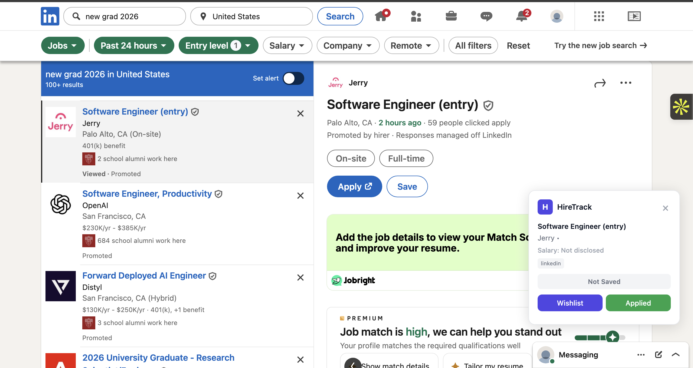
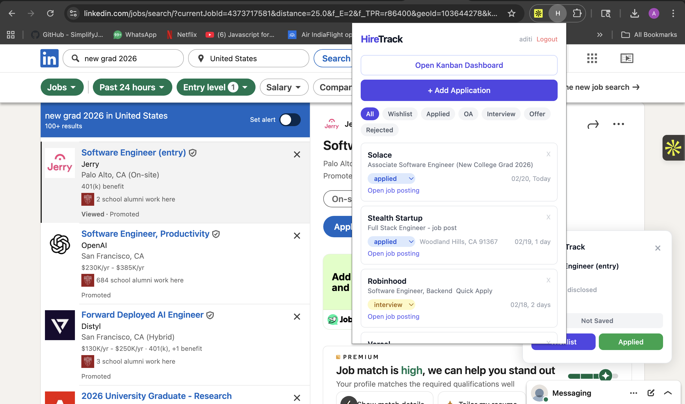
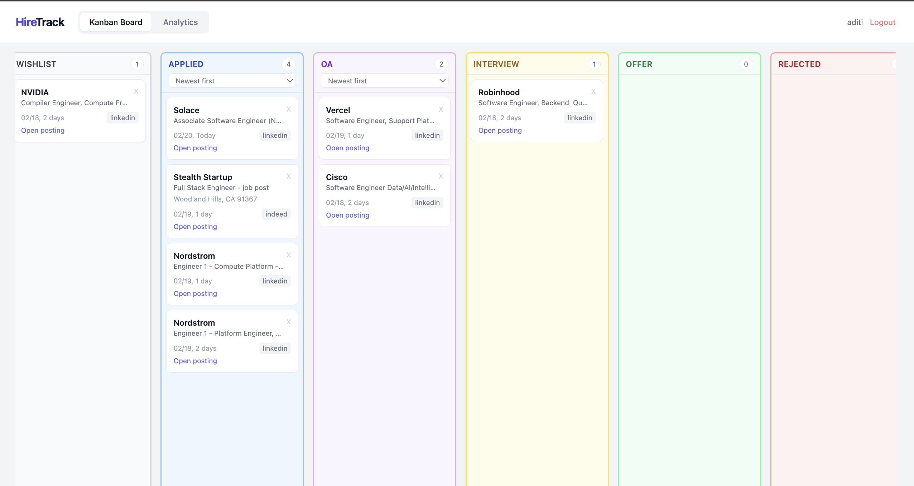
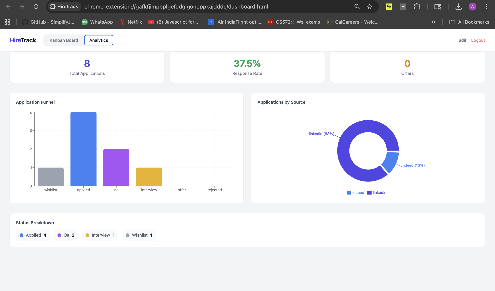

# HireTrack

A full-stack Chrome extension and web dashboard for tracking job applications across 8 platforms with one click.

HireTrack automatically detects job postings on LinkedIn, Indeed, Glassdoor, Greenhouse, Lever, Handshake, Workday, and SimplyHired — then lets you save, organize, and analyze your entire job search from a single dashboard.


---


### Floating Badge — Auto-Detection on Job Sites

When you visit a job posting, HireTrack detects the company, role, location, and salary automatically. Save with one click as Wishlist or Applied.



### Extension Popup — Quick Access

View all your saved applications, filter by status, and add new entries — all without leaving the page you're on.



### Kanban Dashboard — Drag & Drop

Track applications across 6 stages: Wishlist → Applied → OA → Interview → Offer → Rejected. Sort columns by date or name. Click any card to open the original job posting.



### Analytics — Visualize Your Job Search

Application funnel, response rates, and source breakdown at a glance.



---

## Architecture


---

## Features

### Auto-Detection (8 platforms)
LinkedIn, Indeed, Glassdoor, Greenhouse, Lever, Handshake, Workday, and SimplyHired. Content scripts extract company, role, location, salary, and full job description using JSON-LD and DOM parsing. A floating badge lets you save with one click as Wishlist or Applied.

### Cross-Platform Duplicate Detection
Two layers of matching prevent saving the same job twice. URL-based matching catches duplicates on the same platform. Company + role normalization catches the same job posted across different platforms — for example, "Software Engineer at Stripe" on LinkedIn and Indeed are recognized as the same listing.

### Kanban Dashboard
Drag-and-drop board with 6 columns (Wishlist, Applied, OA, Interview, Offer, Rejected). Each column supports sorting by newest, oldest, A→Z, or Z→A. Cards link directly to the original job posting.

### Analytics Dashboard
A funnel bar chart shows how applications progress through stages. A pie chart breaks down which platforms you use most. Summary cards display total applications, response rate, and offer count.

### Authentication & Security
JWT-based auth with 7-day token expiry and bcrypt password hashing. Email normalization prevents duplicate accounts (e.g., `Aditi@USC.edu` and `aditi@usc.edu` are treated as the same). Generic error messages on login prevent user enumeration. All application data is scoped per user to prevent unauthorized access.

---

## Tech Stack

| Layer | Technology | Why |
|-------|-----------|-----|
| Frontend | React 18 + TypeScript | Type safety, component reuse across popup and dashboard |
| Extension | Chrome Manifest V3 | Latest extension platform with service workers |
| Build | Vite + CRXJS | Fast builds, native Chrome extension support |
| Styling | Tailwind CSS | Rapid styling without separate CSS files |
| Drag & Drop | @hello-pangea/dnd | Maintained fork of react-beautiful-dnd |
| Charts | Recharts | Composable chart components for React |
| Backend | FastAPI (Python) | Async-ready, automatic Swagger documentation |
| ORM | SQLAlchemy | Supports SQLite for dev, PostgreSQL for production |
| Auth | python-jose + bcrypt | Industry-standard JWT and password hashing |
| Parsing | BeautifulSoup4 | Server-side HTML parsing fallback |
| Testing | pytest | 24 tests covering auth, CRUD, analytics, and parsers |
| CI/CD | GitHub Actions | Automated testing and Docker build on every push |
| Container | Docker | Reproducible deployments |

---

## Getting Started

### Prerequisites

- Python 3.11+
- Node.js 18+
- Google Chrome

### 1. Backend Setup

```bash
cd backend
python3 -m venv venv
source venv/bin/activate
pip install -r requirements.txt
python3 -m uvicorn app.main:app --reload
```

The API will be running at [http://localhost:8000](http://localhost:8000). Interactive docs available at [http://localhost:8000/docs](http://localhost:8000/docs).

### 2. Extension Setup

```bash
cd extension
npm install
npx vite build
```

### 3. Load the Extension in Chrome

1. Open Chrome and go to `chrome://extensions`
2. Enable **Developer mode** using the toggle in the top-right corner
3. Click **Load unpacked** and select the `extension/dist` folder
4. The HireTrack **H** icon will appear in your extensions bar
5. **Pin it:** Click the puzzle piece icon (🧩) in Chrome's toolbar → find **HireTrack** → click the **pin icon** so the **H** stays visible in your toolbar at all times

### 4. Create Your Account

1. Click the **H** icon in your toolbar to open HireTrack
2. You'll see the **Sign Up** screen — enter your email, password, and name to create an account
3. **Remember your login details** — you'll need them to access your saved applications in future sessions
4. Once signed up, you're automatically logged in and ready to start tracking
5. Your login session lasts 7 days. After that, simply log in again with the same credentials.

Now visit any job posting on LinkedIn, Indeed, Glassdoor, Greenhouse, Lever, Handshake, Workday, or SimplyHired — the HireTrack floating badge will appear automatically. Click **Wishlist** or **Applied** to save the job. Open the **Kanban Dashboard** from the popup to drag-and-drop applications between stages.

### 5. Running Tests

```bash
cd backend
source venv/bin/activate
pytest tests/ -v
```

### 6. Docker (Optional)

```bash
docker compose up --build
```

---

## API Endpoints

All application and analytics endpoints require a valid JWT in the `Authorization: Bearer <token>` header.

| Method | Endpoint | Description |
|--------|----------|-------------|
| POST | `/api/auth/register` | Create account |
| POST | `/api/auth/login` | Log in, receive JWT |
| GET | `/api/auth/me` | Current user info |
| POST | `/api/applications` | Save a new application |
| GET | `/api/applications` | List all (filter by status, search, tag) |
| GET | `/api/applications/:id` | Get one application |
| PUT | `/api/applications/:id` | Update application |
| PATCH | `/api/applications/:id/status` | Change status (e.g., applied → interview) |
| DELETE | `/api/applications/:id` | Delete application |
| GET | `/api/analytics/summary` | Total, response rate, breakdowns |
| GET | `/api/analytics/funnel` | Count per stage |
| POST | `/api/parser/extract-html` | Parse job details from raw HTML |

---

## Project Structure

```
hiretracker/
├── backend/
│   ├── app/
│   │   ├── main.py              # Routes: auth, CRUD, analytics, parser
│   │   ├── models.py            # SQLAlchemy models (User, Application)
│   │   ├── schemas.py           # Pydantic request/response schemas
│   │   ├── database.py          # DB connection and session management
│   │   ├── auth.py              # JWT creation, password hashing, validation
│   │   └── parser_service.py    # HTML parsers (LinkedIn, Greenhouse, Lever)
│   ├── tests/
│   │   ├── test_applications.py # 19 tests: auth, CRUD, analytics, security
│   │   └── test_parsers.py      # 5 tests: parser unit tests
│   ├── Dockerfile
│   └── requirements.txt
│
├── extension/
│   ├── src/
│   │   ├── App.tsx              # Popup: auth check, job list, add form
│   │   ├── api.ts               # API client with token management
│   │   ├── content/
│   │   │   └── detector.ts      # Auto-detection for 8 job sites
│   │   ├── background/
│   │   │   └── service-worker.ts # Token sync, API calls, dedup logic
│   │   ├── components/
│   │   │   ├── AuthScreen.tsx
│   │   │   ├── AddForm.tsx
│   │   │   ├── ApplicationCard.tsx
│   │   │   ├── StatusFilter.tsx
│   │   │   ├── KanbanBoard.tsx
│   │   │   ├── KanbanColumn.tsx
│   │   │   ├── KanbanCard.tsx
│   │   │   └── AnalyticsPanel.tsx
│   │   └── dashboard/
│   │       ├── DashboardApp.tsx  # Full-page dashboard (Kanban + Analytics)
│   │       └── main.tsx
│   ├── manifest.json
│   └── vite.config.ts
│
├── docker-compose.yml
├── .github/workflows/ci.yml
└── .env.example
```

---

